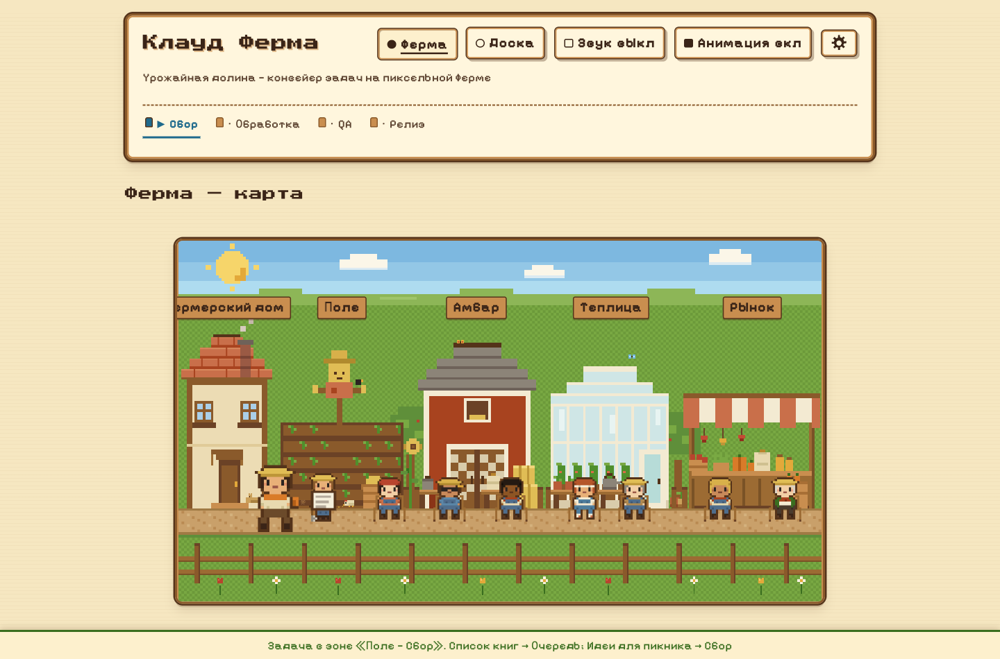
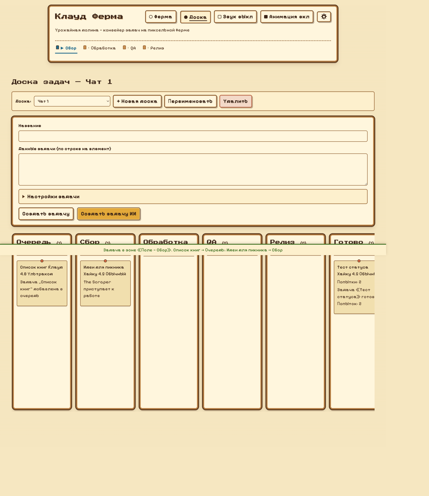
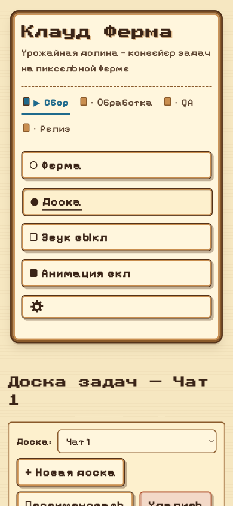

# Клауд Ферма

[English](README.md) · **Русский**

Уютная пиксель‑арт **ферма задач**, которая выполняет настоящую работу через Claude. Задача проходит четыре участка фермы — как урожай от грядки до прилавка, — и на каждом участке её обрабатывает пара агентов: **Driver** делает работу, **Tester** проверяет результат. За ходом дела видно вживую на дашборде в духе Stardew Valley: карта фермы, где жители копают, таскают, поливают и торгуют, и канбан‑доска чатов.

Без единой npm‑зависимости — только встроенные модули Node.js.



---

## Содержание

- [Что это](#что-это)
- [Быстрый старт](#быстрый-старт)
- [Скриншоты](#скриншоты)
- [Как это работает](#как-это-работает)
- [Реальное выполнение (Claude)](#реальное-выполнение-claude)
- [Ультракод: субагенты](#ультракод-субагенты)
- [Доски (чаты)](#доски-чаты)
- [Настройки](#настройки)
- [HTTP API](#http-api)
- [Режим Главного Агента](#режим-главного-агента)
- [Структура проекта](#структура-проекта)
- [Доступность](#доступность)
- [Тесты и CI](#тесты-и-ci)

---

## Что это

Клауд Ферма — это конвейер задач в игровой обёртке. Каждый участок отвечает за свой этап жизни задачи:

| № | id зоны | Участок | Driver | Tester | Что происходит |
|---|---------|---------|--------|--------|----------------|
| 1 | `kitchen`  | Поле — Сбор | The Scraper | The Cleaner | Сбор материалов и плана для задачи |
| 2 | `corridor` | Амбар — Обработка | The Editor | The Validator | **Настоящее выполнение задачи**, проверка по существу |
| 3 | `living`   | Теплица — QA | The Runner | The Sniffer | Прогон «глазами пользователя»; в ультракоде — параллельные субагенты |
| 4 | `bath`     | Рынок — Релиз | The Archiver | The Sign‑Off | Запись `result.md` и `manifest.json`, финальная приёмка |

Сами агенты по ферме не ходят. **Задачи между участками носит только Главный Агент — оркестратор (`src/orchestrator.mjs`).** Он знает маршрут, считает попытки, объявляет события и решает, куда нести задачу после вердикта тестера. Tester возвращает `ОК` (дальше) или `БАГ` (возврат). После слишком многих возвратов (`maxAttempts`, по умолчанию 3) задача проваливается.

Движок — **только Клауд**: настоящий `claude -p`, когда доступен токен, иначе честный откат в симуляцию.

## Быстрый старт

```bash
npm run serve          # поднять дашборд (на macOS откроет Safari)
# затем открыть http://localhost:8787

npm test               # прогнать тесты (без зависимостей, встроенный раннер Node)

node src/farm.mjs run "Список гостей" --input path/to/file.txt   # одна задача из файла
```

Задачи создаются на вкладке **Доска**: введите название и данные, нажмите **Создать задачу** или **Создать задачу ИИ** (Claude разобьёт её на множество подзадач). Переключитесь на вкладку **Ферма** — и смотрите, как жители делают работу; готовый результат окажется в `output/<taskId>/result.md`.

## Скриншоты

| Канбан‑доска | Мобильный вид (адаптив) |
|---|---|
|  |  |

## Как это работает

Каждый шаг порождает событие на внутренней шине. События транслируются на дашборд по **Server‑Sent Events** (`GET /events`) и озвучиваются в консоли. Дашборд превращает их в движение: Босс‑житель носит бумажку между участками, активный работник проигрывает анимацию ремесла (копает на поле, таскает мешки в амбаре, поливает в теплице, торгует на рынке), а карточки канбана перемещаются по колонкам. Внизу экрана статус‑полоса объявляет, что только что произошло.

### Баунс‑бэк на примере: `35.12.2023`

Консольное демо (`npm run demo`, детерминированная симуляция) подаёт 20 строк `Имя;ДД.ММ.ГГГГ`, строка 13 испорчена нарочно: `Игорь;35.12.2023`.

1. **Поле.** The Scraper разбирает файл на строки, The Cleaner подтверждает: работать есть с чем.
2. **Амбар.** The Editor собирает CSV. The Validator проверяет каждую дату как реальную календарную и спотыкается о `35.12.2023`. Формирует заявку на исправление (день обрезается до последнего дня месяца: `35` → `31`) и голосует `БАГ`, возврат в `kitchen`.
3. **Баунс.** Главный Агент увеличивает счётчик попыток и несёт задачу обратно на поле; Scraper пересобирает данные с исправлением.
4. **Второй заход.** Амбар доволен, Теплица не находит дублей и пустых полей, Рынок пишет файлы: «Клиенту можно отправлять!»

## Реальное выполнение (Claude)

Для не‑демо задач ферма запускает настоящий `claude` CLI (`claude -p ... --model <модель>`). The Editor в Амбаре **по‑настоящему выполняет задачу** и пишет результат в markdown; тестеры проверяют его по существу.

Headless‑режиму `claude -p` нужны собственные креды (OAuth‑токен или API‑ключ — ваш интерактивный вход сюда не переносится). Включается один раз:

```bash
claude setup-token          # в настоящем терминале; печатает токен sk-ant-oat…
echo 'ВСТАВЬТЕ_ТОКЕН' > ~/.claude-farm-token
chmod 600 ~/.claude-farm-token
```

При старте сервер читает этот файл: токен `sk-ant-oat…` идёт в `CLAUDE_CODE_OAUTH_TOKEN`, обычный API‑ключ — в `ANTHROPIC_API_KEY`. Затем один раз пробует `claude -p` и сообщает готовность в `GET /api/state` как `claudeExecutor: true`. Файл токена лежит в домашней папке и никогда не попадает в репозиторий. Без него задачи всё равно завершаются — через честный откат в симуляцию с пометкой.

## Ультракод: субагенты

В режиме **Ультракод** перед вердиктом Sniffer'а в Теплице запускаются до 8 **параллельных субагентов** на (обычно более дешёвой) модели. Каждый получает свой тип проверки, типы циклически распределяются по количеству:

| Тип | Инструкция |
|-----|------------|
| `review` (Ревью) | сделай ревью результата |
| `bugs` (Поиск ошибок) | найди ошибки и несостыковки |
| `optimize` (Оптимизация) | предложи улучшения |
| `factcheck` (Факт‑чекинг) | проверь факты |

Их находки сливаются в дайджест, который читает Sniffer: реальные проблемы дают `БАГ` и возврат в Амбар. На карте в это время в теплице появляются работники‑подмастерья.

## Доски (чаты)

Канбан разделён на независимые **доски** — каждая отдельный чат со своим списком задач:

- **Доска:** выпадающий список переключает активную доску.
- **+ Новая доска** создаёт новый чат; **Переименовать** / **Удалить** — переименование и удаление (доска всегда есть хотя бы одна).
- Задача создаётся в выбранной доске и изолирована от других. Общая карта фермы всегда показывает ту задачу, что выполняется прямо сейчас (очередь — единая глобальная FIFO).

## Настройки

Глобальные настройки лежат в `output/settings.json` и доступны через диалог‑шестерёнку или API. Форма плоская (только Клауд):

```json
{
  "model": "claude-opus-4-8",
  "mode": "ultracode",
  "subagents": { "model": "claude-sonnet-4-6", "count": 3, "types": ["review", "bugs"] }
}
```

```bash
curl -s localhost:8787/api/settings
curl -s -X PUT localhost:8787/api/settings -d '{"model":"claude-sonnet-4-6","mode":"normal"}'
```

`PUT` принимает частичный патч и строго валидирует перечисления. Каталог моделей — в `farm.config.json` (`claudeModels`).

### Конфиг на задачу

`POST /api/task` принимает необязательный `config`, который накладывается поверх глобальных настроек и сохраняется на задаче (виден бейджами модели/режима на карточке канбана):

```bash
curl -s -X POST localhost:8787/api/task \
  -d '{"title":"Отчёт","input":"...","boardId":"b1","config":{"model":"claude-haiku-4-5-20251001","mode":"normal","subagents":{"count":0,"types":[]}}}'
```

## HTTP API

| Метод и путь | Назначение |
|---|---|
| `GET /events` | SSE‑поток событий конвейера |
| `GET /api/state` | зоны, `claudeExecutor`, последние 100 событий |
| `GET /api/tasks?board=<id>` | задачи доски (по умолчанию — активной) |
| `POST /api/task` | создать задачу `{title, input, mode, boardId, config}` → `202 {taskId}` |
| `GET /api/boards` | `{boards, activeBoardId}` |
| `POST /api/boards` | создать доску `{name?}` |
| `PATCH /api/boards/:id` | переименовать `{name}` |
| `DELETE /api/boards/:id` | удалить доску и её задачи |
| `GET / PUT /api/settings` | прочитать / пропатчить глобальные настройки |
| `POST /api/event` | внедрить внешнее событие (режим Главного Агента) |

## Режим Главного Агента

Ферму может вести внешний оркестратор — например, Claude Code в роли Главного Агента — выполняя настоящую работу своими субагентами и транслируя каждый шаг на дашборд через `POST /api/event`:

```bash
curl -s -X POST localhost:8787/api/event \
  -d '{"type":"zone.enter","taskId":"boss-1","zone":"kitchen","message":"Задача переходит в зону «Поле — Сбор»"}'
```

Допустимые `type`: `task.created`, `task.queued`, `zone.enter`, `driver.start`, `driver.done`, `tester.start`, `tester.ok`, `tester.bounce`, `task.done`, `task.failed`. Внешние события отображаются точно так же, как события встроенной фермы.

## Структура проекта

```
claude-farm/
├── farm.config.json      # порт, maxAttempts, executor, каталог моделей, зоны
├── package.json          # scripts: demo, serve, start, test
├── src/
│   ├── farm.mjs          # CLI: demo | serve [--port N] [--no-open] | run "<title>" --input <file>
│   ├── orchestrator.mjs  # Главный Агент: маршрут по участкам, баунсы, лимит попыток
│   ├── events.mjs        # шина событий: seq+ts, история, JSONL‑лог, подписки
│   ├── agents.mjs        # sim‑агенты, claude‑агенты, ультракод‑субагенты
│   ├── tasks.mjs         # стор задач, FIFO‑очередь, доски, настройки
│   └── server.mjs        # http: статика, SSE, /api/state|tasks|task|boards|settings|event
├── dashboard/
│   ├── index.html        # карта фермы + канбан‑доска (два вида)
│   ├── style.css         # пиксель‑арт, плотность 90%, адаптив, состояния участков
│   ├── app.js            # EventSource, рендер доски, хореография, формы
│   └── assets/           # оригинальные пиксельные спрайты + сцена фермы (SVG)
├── demo/demo-task.txt    # демо‑данные: 20 строк, одна битая дата
├── test/                 # node --test (настоящий CLI в тестах не запускается)
└── output/               # результаты задач, farm-state.json, settings.json
```

## Доступность

Дашборд собран по WCAG AA. Состояния участков передаются текстом и глифом (не только цветом); статусные объявления коалесцируются в единый регион `role="status"` (видимая нижняя полоса); прогресс отмечен `aria-current="step"`; карта фермы декоративна (`aria-hidden`); все анимации уважают `prefers‑reduced‑motion` и кнопку паузы **Анимация**; звук по умолчанию выключен за кнопкой с `aria-pressed`; вёрстка корректно перетекает вплоть до ~320px и при зуме 200%, тач‑таргеты ≥44px.

## Тесты и CI

```bash
npm test
```

Набор работает на встроенном раннере Node без зависимостей и никогда не запускает настоящий CLI. GitHub Actions прогоняет его на каждый push (`.github/workflows/ci.yml`).
